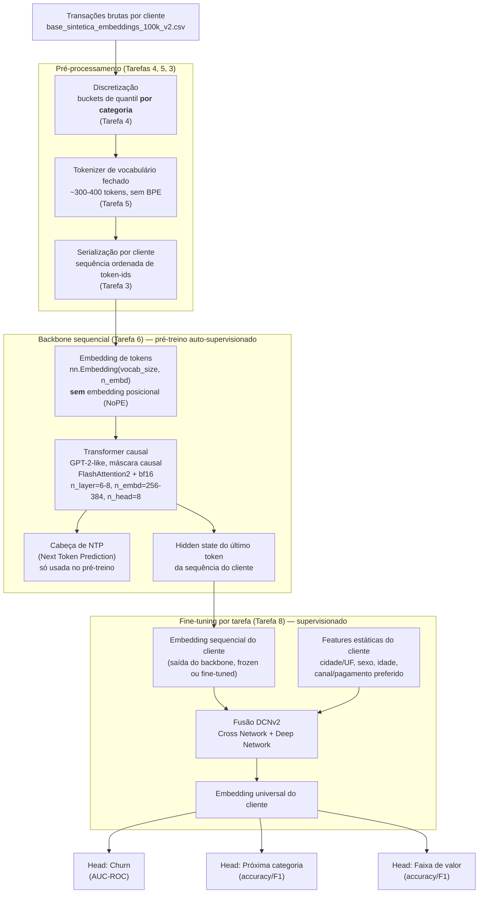

# Arquitetura da solução — Customer Foundation Model

Desenho fim-a-fim do pipeline: **tokenização (buckets) → embedding → Transformer causal (NTP, NoPE, FlashAttention2) → fusão (DCNv2) → embedding universal**. Cada estágio referencia a tarefa do `ROADMAP.md` que o implementa.

---

## Diagrama geral



---

## Estágio 1 — Tokenização (buckets)

**Onde**: Tarefas 4 e 5. **Entrada**: `base_sintetica_embeddings_100k_v2.csv` + `splits.csv`. **Saída**: vocabulário fechado (JSON) + funções de bucketing.

Cada transação vira um "sub-bloco" de tokens categóricos, todos vindos de um vocabulário **fechado e enumerado manualmente** (sem BPE/subword — cardinalidades baixas o justificam):

| Campo | Tratamento | Nº de tokens aprox. |
|---|---|---|
| `categoria_produto` | categórico direto | 4 |
| `marca` | categórico direto | 4 |
| `fabricante` | categórico direto | 3 |
| `forma_pagamento` | categórico direto | 3 |
| `canal_venda` | categórico direto | 3 |
| `cod_produto` | categórico direto | 180 |
| `valor_total` | bucket de quantil **por categoria** (10 buckets × 4 categorias) | 40 |
| `desconto` | bucket de quantil **por categoria** | 40 |
| `quantidade` | categórico direto (1-10) | 10 |
| delta-recência | bucket sobre gap em dias desde a última compra: `[0-7,8-15,16-30,31-60,61-90,91-180,181-365,>365]` | 8 |
| sazonalidade | mês (1-12) ou trimestre | 12 |
| estruturais | `BOS`, `EOS`, `EVT`, `PAD`, `UNK` | 5 |
| **Total** | | **~310** |

Ponto crítico (Tarefa 4): os buckets de `valor_total`/`desconto` são calculados **separadamente por categoria** porque Máquinas tem escala de preço ~8-9x maior que as demais — um bucketing global desperdiçaria resolução. Os limites de quantil são calibrados **só no split de treino** e reaplicados em val/teste (nunca recalculados) para não vazar informação de val/teste (skill `temporal-customer-splits` + `customer-sequence-serialization`).

`latitude`/`longitude` brutos **não** entram na tokenização (são jitter em torno do centro da cidade, sem informação além de `cidade`/`uf`, que já é um campo estático do cliente).

---

## Estágio 2 — Embedding

**Onde**: dentro da Tarefa 6 (parte do modelo). **Mecanismo**: uma única tabela de embedding `nn.Embedding(vocab_size, n_embd)`, compartilhada por todos os tokens da sequência (categóricos, buckets e estruturais).

Diferença chave em relação a um Transformer padrão: **não há soma de embedding posicional** (NoPE). Cada token entra no modelo representado só pelo seu embedding de conteúdo — a posição relativa entre tokens é inferida pelo próprio Transformer a partir do padrão de atenção causal (mask triangular), não por um vetor de posição somado a priori. Isso é o que permite ao modelo generalizar para sequências de cliente mais longas do que as vistas em treino sem precisar retreinar do zero.

A ordem dos campos dentro de cada evento é fixa (categoria → marca → fabricante → valor → desconto → quantidade → pagamento → canal → recência → sazonalidade) — essa ordem consistente é o que dá ao NoPE algo estável para aprender como "sintaxe" implícita.

---

## Estágio 3 — Transformer causal (NTP, NoPE, FlashAttention2)

**Onde**: Tarefa 6. **Objetivo do pré-treino**: Next Token Prediction — dado o prefixo da sequência de um cliente, prever o próximo token, com máscara causal (cada posição só atende às anteriores).

- **Arquitetura**: GPT-2-like (HuggingFace `GPT2Config`/`GPT2LMHeadModel` como base), com a matriz de position embeddings (`wpe`) removida/neutralizada (NoPE).
- **Atenção**: `attn_implementation="flash_attention_2"` — custo de memória O(seq_len) em vez de O(seq_len²), viabilizando batch sizes maiores em ~16GB de VRAM.
- **Dimensionamento**: `n_embd=256-384`, `n_layer=6-8`, `n_head=8`, `n_positions=128` (cobre p99=40 e max=88 eventos/cliente observados na base v2, com folga). ~10-30M de parâmetros — modesto de propósito, dado o volume de 15.000 clientes.
- **Precisão**: `bfloat16` (obrigatório para FlashAttention2 funcionar).
- **Saída relevante para as próximas etapas**: não é a cabeça de NTP em si (usada só durante o pré-treino), mas o **hidden state do último token da sequência** de cada cliente — essa é a representação vetorial ("embedding sequencial") que carrega o comportamento aprendido daquele cliente até o momento.
- **Experimento planejado**: currículo de janela truncada (treinar com últimos 24-32 eventos) + avaliação de extrapolação em sequências completas (clientes de cauda, >40 eventos) — testa concretamente se o NoPE generaliza no nosso domínio, sem precisar esperar até o fim do projeto.

---

## Estágio 4 — Fusão (DCNv2)

**Onde**: fase de fine-tuning (consome o resultado das Tarefas 6 e 8). **Objetivo**: combinar o embedding sequencial (comportamento dinâmico, aprendido pelo Transformer) com features estáticas do cliente (cadastro, não-sequenciais) em uma única representação.

**Por que DCNv2 e não só concatenar + MLP**: o Deep & Cross Network v2 modela explicitamente interações **multiplicativas** entre features (ex.: "cliente de Máquinas" × "canal Online" pode ter um efeito diferente de cada um isoladamente), via uma pilha de camadas de cruzamento:

```
x_{l+1} = x_0 ⊙ (W_l · x_l + b_l) + x_l
```

onde `x_0` é o vetor de entrada concatenado (embedding sequencial + features estáticas), e cada camada de cruzamento adiciona interações de ordem crescente sem explodir o número de parâmetros (diferente de uma MLP pura, que precisa de muito mais capacidade para aprender as mesmas interações implicitamente). Em paralelo, uma torre "deep" (MLP convencional) captura padrões não-lineares mais gerais. As saídas das duas torres (cross + deep) são concatenadas e alimentam as cabeças de tarefa.

**Entradas da fusão**:
- **Dinâmica**: hidden state final do Transformer (Estágio 3) — captura preferências, recência, frequência, sazonalidade individual já aprendidas na sequência.
- **Estática**: campos que não mudam entre eventos do cliente — `cidade`/`uf`, `sexo`, idade (derivada de `data_nascimento`), e (opcionalmente) as preferências mais frequentes do cliente como features agregadas simples (ex. moda histórica de `forma_pagamento`), redundantes de propósito com o que o Transformer já aprende, mas úteis como sinal direto para a Cross Network explorar interações.

**Modo de treino**: duas opções, a decidir empiricamente na Tarefa 8:
1. **Backbone congelado** — só a DCNv2 + heads são treinadas (mais rápido, menos risco de overfitting com 15.000 clientes, é o ponto de partida recomendado).
2. **Fine-tuning conjunto** — backbone + DCNv2 + heads treinados juntos com learning rate menor no backbone (testar só se a opção 1 não for suficiente).

---

## Estágio 5 — Embedding universal

**Onde**: saída da fusão DCNv2, antes das cabeças de tarefa. **Definição**: um único vetor por cliente, reutilizável por qualquer uma das tarefas downstream (churn, próxima categoria, faixa de valor, e futuras tarefas ainda não definidas) sem precisar retreinar o backbone sequencial a cada nova tarefa — esse é o valor central de um "Customer Foundation Model" (mesma ideia dos posts do Nubank referenciados no kickoff).

Em produção, esse embedding seria computado em lote (ex. diariamente/semanalmente, conforme novas transações chegam) e armazenado (feature store ou índice vetorial), para ser consumido por múltiplos modelos/times sem cada um precisar rodar o Transformer do zero.

**Heads de tarefa** (Tarefa 8) consomem o embedding universal como entrada de um classificador simples (linear ou MLP raso) — mantendo o backbone + fusão como o componente caro/compartilhado, e as heads como o componente barato/específico por tarefa.

---

## Mapeamento estágio ↔ tarefa do roadmap

| Estágio | Tarefa(s) | Status |
|---|---|---|
| Tokenização (buckets) | Tarefa 4 (discretização), Tarefa 5 (vocabulário) | pendente |
| Serialização em sequência | Tarefa 3 | pendente |
| Embedding + Transformer causal | Tarefa 6 | pendente |
| Rótulos para as heads | Tarefa 8 | pendente |
| Fusão DCNv2 + embedding universal | parte da Tarefa 8 (heads consomem a fusão) | pendente |
| Splits (pré-requisito de tudo acima) | Tarefa 7 | ✅ concluída |
